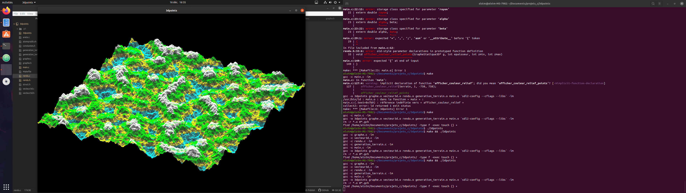

# Moteur 3D fil de fer en C

### Presentation

Le projet est de programmer un moteur 3D fil de fer (sans texture ni surface) en partant de presque zéro. 
La seule bibliothèque externe utilisé est la SDL permettant de créer la fenêtre et de modifier ses pixels.

[Démonstration vidéo](http://82.65.166.163/1to/fichiers/3dbg.ogv)

_(présentation a completer)_
